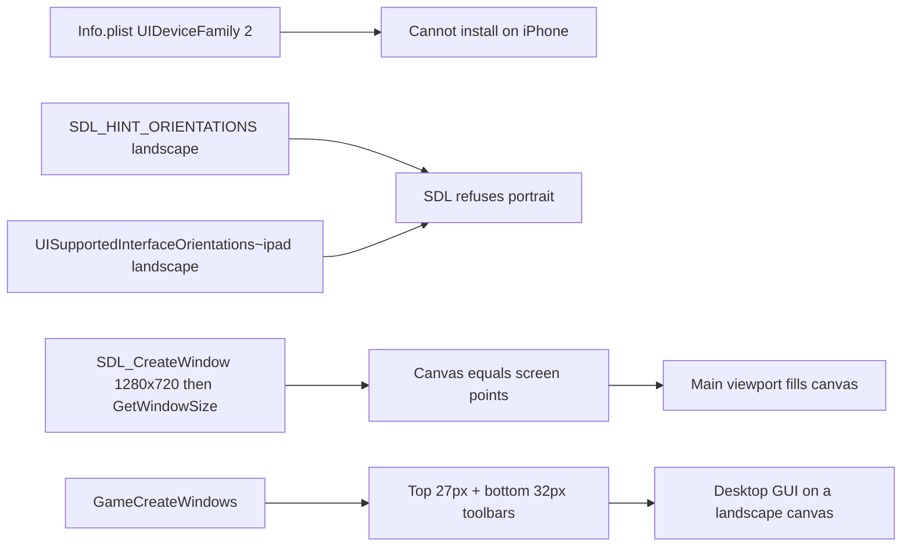
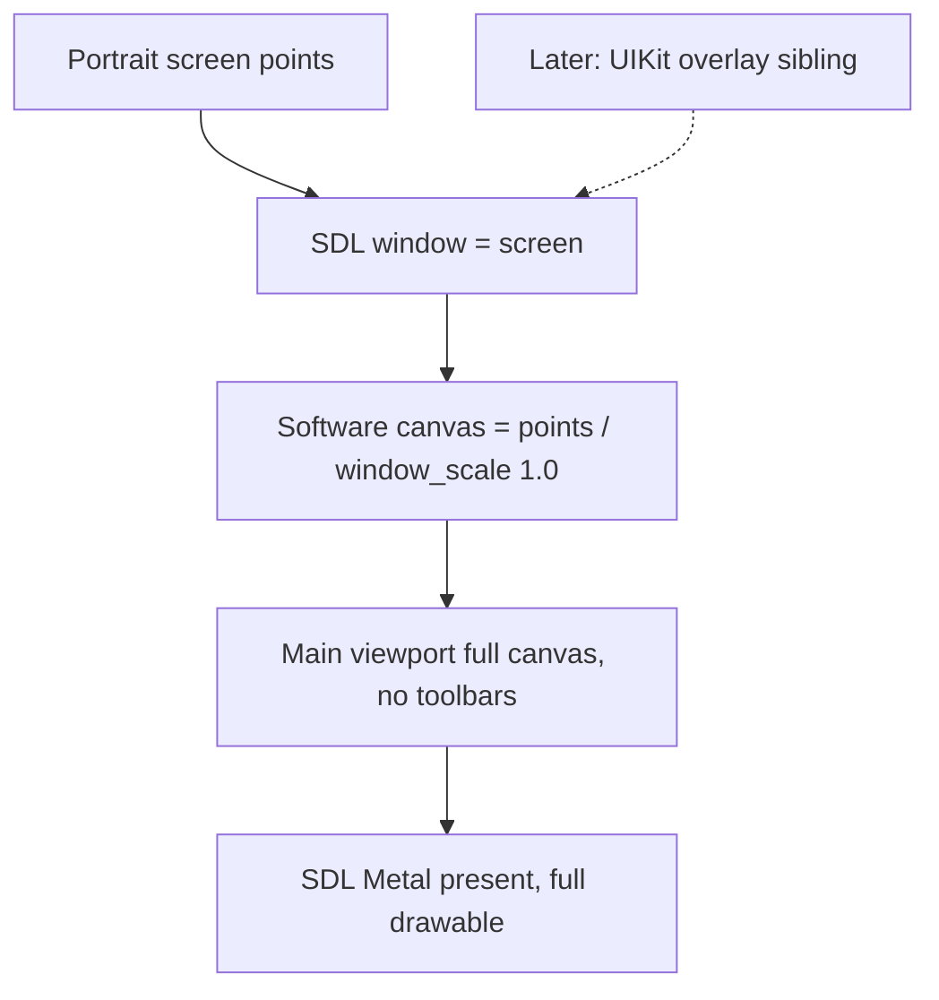

# iOS portrait viewport

The iPad app already is an iOS/UIKit binary. It does **not** need a new engine, SDK, or dependency slice. What blocks iPhone today is an iPad-only device-family lock and a landscape-only window contract. What blocks the red-box view is that the engine currently paints a full landscape GUI, not a tall park viewport.

This is an explicit scope change: Goal 6/7 landscape proofs pause. Portrait on both iPhone and iPad becomes the new device contract. Re-run pointer/touch checks in portrait after the viewport is stable.

## What is already true

- Same `iphoneos` / `iphonesimulator` arm64 artifacts: `[ios/toolchain/ios.toolchain.cmake](ios/toolchain/ios.toolchain.cmake)`, `[ios/CMakeLists.txt](ios/CMakeLists.txt)`. iPhone does not need a vcpkg rebuild.
- Software framebuffer → SDL Metal already works (`[HardwareDisplayDrawingEngine.cpp](src/openrct2-ui/drawing/engines/HardwareDisplayDrawingEngine.cpp)`).
- iOS already defaults `infer_display_dpi` to false and `window_scale` to 1, so the **canvas is in points**, not 3× pixels (`[Config.cpp](src/openrct2/config/Config.cpp)`). Keep that. A 3× canvas on iPhone would be ~131×284 and unusable.
- Files import, sandbox paths, and SDL scene lifecycle are shared UIKit code (`[RCT2Importer.iOS.mm](ios/platform/RCT2Importer.iOS.mm)`, `[UiContext.iOS.mm](ios/platform/UiContext.iOS.mm)`).

## What is locked to iPad landscape today

Hard locks:

- `[ios/App/Info.plist](ios/App/Info.plist)`: `UIDeviceFamily` is `2` (iPad only). No unsuffixed `UISupportedInterfaceOrientations`. iPhone cannot install this app.
- `[ios/CMakeLists.txt](ios/CMakeLists.txt)`: `XCODE_ATTRIBUTE_TARGETED_DEVICE_FAMILY "2"`.
- `[UiContext.iOS.mm](ios/platform/UiContext.iOS.mm)`: `SDL_SetHint(SDL_HINT_ORIENTATIONS, "LandscapeLeft LandscapeRight")`.
- `[scripts/run-ios-sim.sh](scripts/run-ios-sim.sh)` / `[seed-ios-sim-data.sh](scripts/seed-ios-sim-data.sh)`: only boot iPad Simulators.
- `[Game.cpp](src/openrct2/Game.cpp)` always opens `topToolbar` + `bottomToolbar`. Bottom toolbar is hard-min **640px** wide (`[Window.cpp](src/openrct2/interface/Window.cpp)` `WindowResizeGuiScenarioEditor`). Top toolbar icons are laid out to ~560px+.
- Scenario select is **734×384** (`[ScenarioSelect.cpp](src/openrct2-ui/windows/ScenarioSelect.cpp)`). Scenery picker min width is **634** (`[Scenery.cpp](src/openrct2-ui/windows/Scenery.cpp)`). Ride construction is **210×394** (fits a phone).

Approximate portrait canvases at `window_scale = 1` (points):

- iPhone 15/16 Pro: ~393×852. Title menu (~328px) fits. Scenario select and scenery picker overflow. Top toolbar does not fit.
- iPad 11-inch: ~834×1194. 734/634 windows still fit. Toolbar is tight but possible.
- iPad 12.9-inch: ~1024×1366. Desktop windows fit; the view is already the tall slice you marked in red.

So: iPad portrait is mostly a geometry/orientation change. iPhone portrait requires hiding chrome **and** a plan for oversized in-engine windows (clamp/scroll for now; native lists later).

## Rendering model: tall canvas, not a crop compositor

Do **not** keep a landscape framebuffer and blit the red rectangle. That wastes fill rate, breaks hit-testing, and leaves toolbars laid out for a width that is not on screen.

Do this instead: the SDL window **is** the portrait screen. The software canvas and main viewport become that same tall rectangle. The isometric world is unchanged; the camera simply sees a narrower, taller window into the park — which is what the red box is illustrating.

Safe areas: iPhone has Dynamic Island + home indicator; iPad has a home indicator. Insets are logged (`[AppLifecycle.iOS.mm](ios/App/AppLifecycle.iOS.mm)`). Present the canvas full-screen; do not letterbox for the notch or home indicator.

Skip `SDL_SetWindowMinimumSize(720, 480)` on iOS (`[UiContext.cpp](src/openrct2-ui/UiContext.cpp)` around line 1550). UIKit owns the size; that desktop floor fights iPhone widths.

`SetFullscreenMode` is already a no-op on iOS — keep that.

## Chrome: hide now, replace later

v1 of this track does **not** rebuild OpenRCT2 windows. It stops drawing the two bars in your screenshot (top icon strip, bottom money/date bar).

- Gate `ContextOpenWindow(WindowClass::topToolbar/bottomToolbar)` in `[GameCreateWindows](src/openrct2/Game.cpp)` behind an iOS “native chrome” flag.
- Treat toolbar height as 0 in `[WindowManager.cpp](src/openrct2-ui/WindowManager.cpp)` placement (`kTopToolbarHeight`) so construction windows are not shoved under empty chrome.
- Leave in-engine tool windows (ride construction, footpath, scenery) for now so the game is still reachable without a native toolbar. On iPhone, clamp/centre windows that exceed the canvas so they are at least partially usable; scenery/scenario select will be ugly until native UI exists.
- Title screen stays in-engine for slice 1–2 (four 82px buttons fit a phone). Scenario select on iPhone is the known sharp edge.

Native overlay (later, not this first implementation): add a pass-through `UIView` sibling on the SDL UIKit window (same `SDL_SysWMinfo` path the importer already uses). Buttons call existing OpenRCT2 intents (`PauseToggle`, construct ride, scenery, footpath, save, etc.). Do not start that overlay until the portrait viewport is screenshot-green.

## Slice 1 — Universal install (landscape still allowed only as a debug fallback)

Proof: iPhone Simulator and iPad Simulator both install and launch the same bundle.

- `UIDeviceFamily` = `1, 2`; `TARGETED_DEVICE_FAMILY` = `1,2`.
- Add unsuffixed `UISupportedInterfaceOrientations` **and** keep `~ipad`. Initially allow portrait + landscape so we can prove boot before the lock (or lock portrait immediately if SDL resize is already handled — prefer lock portrait once `SDL_WINDOWEVENT_RESIZED` is verified).
- Asset catalog is already `idiom: universal`; extend `[verify-ios-bundle.sh](scripts/verify-ios-bundle.sh)` for iPhone icons without dropping the iPad check.
- Teach `[run-ios-sim.sh](scripts/run-ios-sim.sh)` an iPhone destination (e.g. iPhone 16 Pro) in addition to iPad. Same sim arm64 `.app`.
- Human gate: first physical iPhone signing/trust, same as the first iPad. Use existing `OPENRCT2_DEVELOPMENT_TEAM` / `OPENRCT2_DEVICE_UDID`.

Personal Simulator installs may copy ignored `ref/rct2` into the local `.app`. Do not git-track that payload or put it in an IPA.

## Slice 2 — Portrait canvas on iPhone and iPad

Proof: Simulator screenshots on iPhone Pro and iPad Pro show a **taller-than-wide** park framebuffer, Metal present, correct aspect, no landscape letterboxing of a 16:9 game.

- `SDL_HINT_ORIENTATIONS` = `Portrait` (optionally `PortraitUpsideDown` on iPad only).
- Plist: iPhone `UIInterfaceOrientationPortrait`; iPad portrait + portrait upside down. Drop landscape.
- On resize: `OnResize` already sets canvas from window points (`[UiContext.cpp](src/openrct2-ui/UiContext.cpp)`). Confirm iOS fires `SDL_WINDOWEVENT_RESIZED` at launch and on rotation during the transition.
- Present dest rect = full drawable (no safe-area letterbox); log `window_points`, `drawable_pixels`, `canvas`, `safe_area` as diagnostics. Canvas size must match window points.
- Do not infer Retina as `window_scale`.

iPad in portrait **is** the red-box view: same isometric park, less horizontal FOV, more vertical FOV, more panning.

## Slice 3 — Hide in-engine toolbars

Proof: in-game screenshot has no top icon bar and no bottom status bar; the main viewport uses the full canvas. Pause/load still reachable from the title screen and/or keyboard shortcuts until native buttons exist.

- Skip toolbar creation on iOS (feature flag so macOS headless is unchanged).
- Fix window auto-position that assumes a 27px top toolbar.
- Document that construction tools remain in-engine windows for now.

## Slice 4 — iPhone-sized in-engine windows (minimum playable)

Proof: title → scenario list → park loads on iPhone Simulator without an unusable off-screen scenario window.

- Clamp `scenarioSelect` / `loadSave` / `scenery` to `min(windowSize, ContextGetWidth/Height)` or open them at screen size with existing `WindowFlag::resizable` where present.
- Do **not** rewrite those UIs. This is overflow survival until native lists exist.

## Native overlay (explicitly later)

After slices 1–4 are green: UIKit/SwiftUI overlay mapped to the same actions as the hidden toolbar. Status (cash, guests, date, weather) as native labels. This contradicts the v1 non-goal “we don’t rebuild windows” in `[docs/openrct2-ipados-BUILD-PLAN.md](docs/openrct2-ipados-BUILD-PLAN.md)` §1.2 — update that doc when work starts, not before the viewport works.

## What not to do

- Do not rebuild vcpkg for iPhone.
- Do not enable OpenGL or crop-blit a landscape texture.
- Do not git-track `ref/` / RCT2 data or copy it into an IPA or xcarchive.
- Do not treat iPhone 3× as `window_scale`.
- Do not start native buttons in the same change as the first iPhone boot.
- Do not commit to `develop` or upstream.

## Verification

Inner: `./scripts/check-repo-safety.sh`, `./scripts/build-macos.sh`, `./scripts/run-macos-headless.sh` (toolbar skip must be iOS-only).

Middle: `./scripts/build-ios.sh sim`, then iPhone **and** iPad Simulator launch + screenshot (extend `run-ios-sim.sh`).

Outer: signed install on physical iPhone and iPad (human provisioning). Re-check Files import, then a short portrait pan/zoom. Goal 6/7 end-to-end scripts wait until chrome/overlay exists or the human plays with remaining in-engine windows.

## Human gates

- First iPhone code-sign/trust.
- Touch feel in portrait (especially two-finger pan on a tall view).
- Whether oversized scenery/scenario windows are acceptable until native UI (feel judgment).

